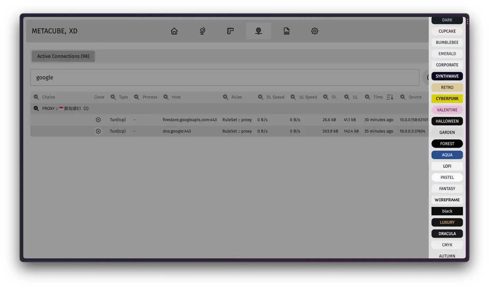

# metacubexd

Clash.Meta Dashboard, The Official One, XD


## Preview




## Published Official Links

GH Pages Custom Domain: http://d.metacubex.one

GH Pages: https://metacubex.github.io/metacubexd

Cloudflare Pages: https://metacubexd.pages.dev

## Usage

### Enable external-controller in your config file

```yaml
external-controller: 0.0.0.0:9090
```

### Use pre-built assets from gh-pages branch

> First time setup

```shell
git clone https://github.com/metacubex/metacubexd.git -b gh-pages /etc/clash-meta/ui
```

Make sure you have external-ui directory set correctly in your config file

```yaml
external-ui: /etc/clash-meta/ui
```

> Update

```shell
git -C /etc/clash-meta/ui pull -r
```

### Run inside Docker

> docker cli

Running

```shell
docker run -d --restart always -p 80:80 --name metacubexd ghcr.io/metacubex/metacubexd
```

Update and Restart

```shell
docker pull ghcr.io/metacubex/metacubexd && docker restart metacubexd
```

> docker-compose.yml

```yaml
version: '3'

services:
  metacubexd:
    container_name: metacubexd
    image: ghcr.io/metacubex/metacubexd
    restart: always
    ports:
      - '80:80'

  # optional
  meta:
    container_name: meta
    image: docker.io/metacubex/clash-meta:Alpha
    restart: always
    network_mode: host
    cap_add:
      - NET_ADMIN
    volumes:
      - ./config.yaml:/root/.config/clash
```

Running

```shell
docker compose up -d
```

Update and Restart

```shell
docker compose pull && docker compose up -d
```

### Build locally

> Install npm dependencies

```shell
pnpm install
```

> Build artifacts

```shell
pnpm build
```

> Serve static files

```shell
pnpm serve
```

## Contributors

This project is only possible thanks to these amazing people.


## Credits

- [Clash.Meta](https://github.com/MetaCubeX/Clash.Meta)
- [SolidJS](https://github.com/solidjs/solid)
- [daisyUI](https://github.com/saadeghi/daisyui)
