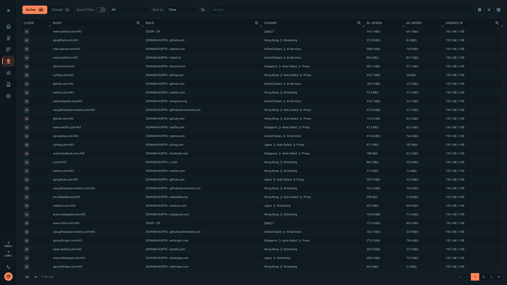
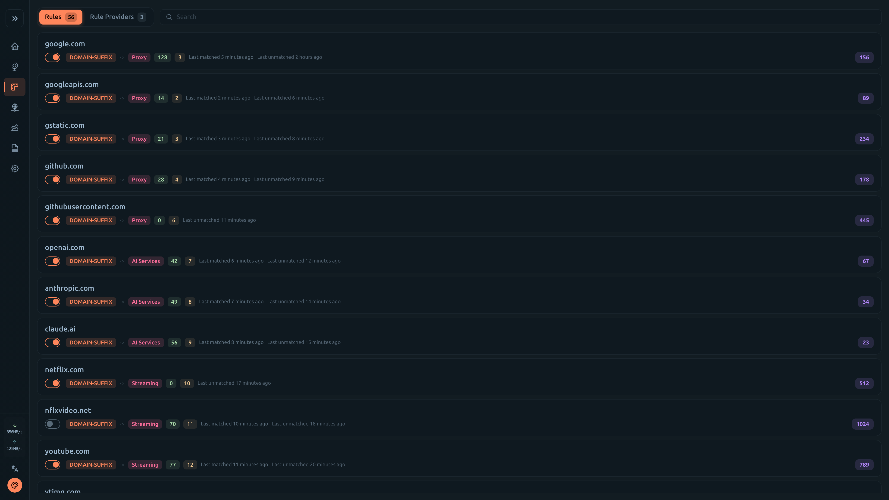
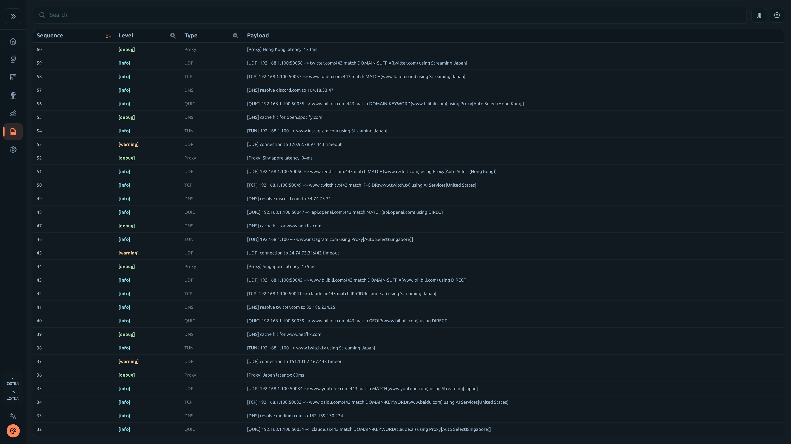
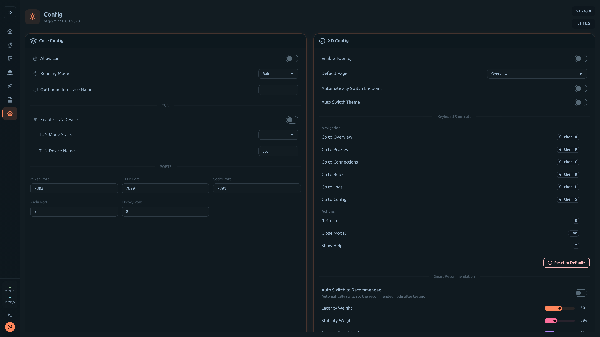
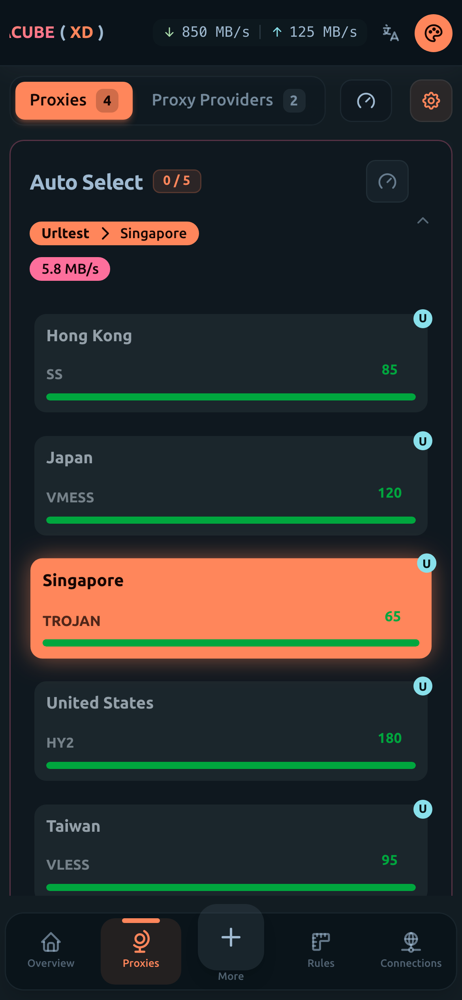
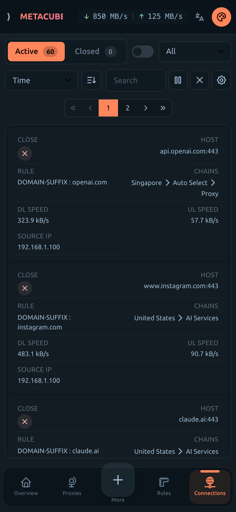
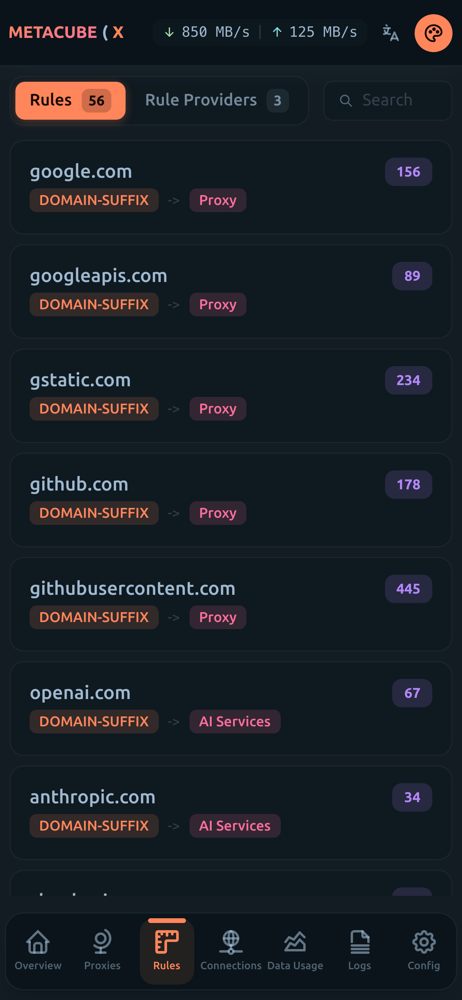
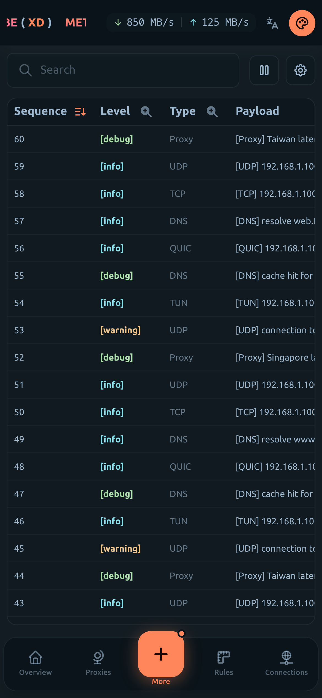
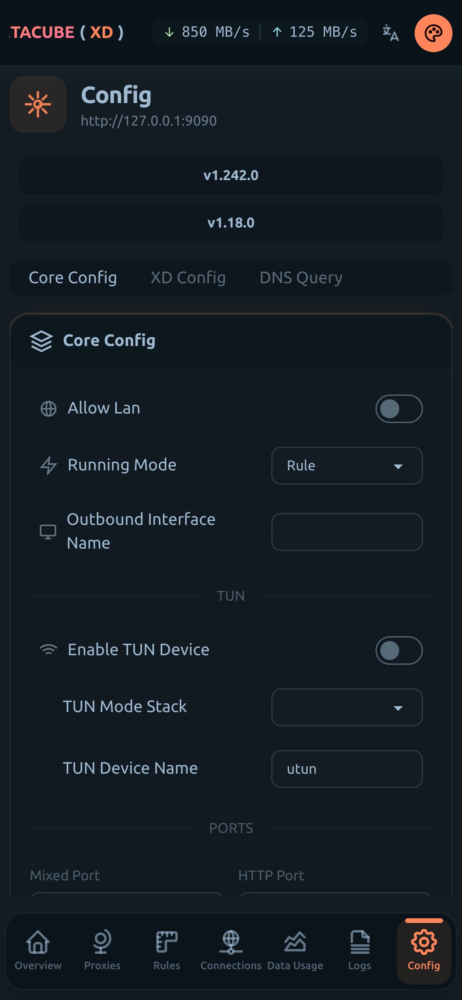

# metacubexd

**Mihomo Dashboard, The Official One, XD**

[](https://github.com/metacubex/metacubexd/pulls)
[](https://github.com/metacubex/metacubexd/commits)
[](https://github.com/metacubex/metacubexd/actions)
[](https://github.com/metacubex/metacubexd/releases)
[](./LICENSE)

## ✨ Features

- 📊 Real-time traffic monitoring and statistics
- 🔄 Proxy group management with latency testing
- 📡 Connection tracking and management
- 📋 Rule viewer with search functionality
- 📝 Live log streaming
- 🎨 Beautiful UI with light/dark theme support
- 📱 Fully responsive design for mobile devices
- 🌐 Multi-language support (English, 中文, Русский)

## 🖼️ Preview

<details>
<summary><b>Desktop Screenshots</b></summary>

|                           Overview                            |                           Proxies                           |
| :-----------------------------------------------------------: | :---------------------------------------------------------: |
|  |  |

|                             Connections                             |                          Rules                          |
| :-----------------------------------------------------------------: | :-----------------------------------------------------: |
|  |  |

|                         Logs                          |                          Config                           |
| :---------------------------------------------------: | :-------------------------------------------------------: |
|  |  |

</details>

<details>
<summary><b>Mobile Screenshots</b></summary>

|                             Overview                              |                             Proxies                             |                               Connections                               |
| :---------------------------------------------------------------: | :-------------------------------------------------------------: | :---------------------------------------------------------------------: |
|  |  |  |

|                            Rules                            |                           Logs                            |                            Config                             |
| :---------------------------------------------------------: | :-------------------------------------------------------: | :-----------------------------------------------------------: |
|  |  |  |

</details>

## 🔗 Official Links

| Platform         | URL                                    |
| :--------------- | :------------------------------------- |
| GitHub Pages     | https://metacubex.github.io/metacubexd |
| Cloudflare Pages | https://metacubexd.pages.dev           |

## 🚀 Quick Start

### Prerequisites

Enable external-controller in your mihomo config:

```yaml
external-controller: 0.0.0.0:9090
```

### Option 1: Use Pre-built Assets

```shell
# Clone the gh-pages branch
git clone https://github.com/metacubex/metacubexd.git -b gh-pages /etc/mihomo/ui

# Set external-ui in your config
# external-ui: /etc/mihomo/ui

# Update to latest version
git -C /etc/mihomo/ui pull -r
```

### Option 2: Docker

```shell
# Basic usage
docker run -d --restart always -p 80:80 --name metacubexd ghcr.io/metacubex/metacubexd

# With custom default backend URL
docker run -d --restart always -p 80:80 --name metacubexd \
  -e DEFAULT_BACKEND_URL=http://192.168.1.1:9090 \
  ghcr.io/metacubex/metacubexd

# Update
docker pull ghcr.io/metacubex/metacubexd && docker restart metacubexd
```

<details>
<summary><b>Docker Compose</b></summary>

```yaml
services:
  metacubexd:
    container_name: metacubexd
    image: ghcr.io/metacubex/metacubexd
    restart: always
    ports:
      - '80:80'
    # environment:
    #   - DEFAULT_BACKEND_URL=http://192.168.1.1:9090

  # Optional: mihomo instance
  mihomo:
    container_name: mihomo
    image: docker.io/metacubex/mihomo:Alpha
    restart: always
    pid: host
    network_mode: host
    cap_add:
      - ALL
    volumes:
      - ./config.yaml:/root/.config/mihomo/config.yaml
      - /dev/net/tun:/dev/net/tun
```

```shell
docker compose up -d

# Update
docker compose pull && docker compose up -d
```

</details>

### Option 3: Build from Source

```shell
# Install dependencies
pnpm install

# Build
pnpm build

# Preview
pnpm serve
```

## 🛠️ Development

```shell
# Start dev server
pnpm dev

# Start dev server with mock data
pnpm dev:mock

# Lint & Format
pnpm lint
pnpm format
```

## 📄 License

[MIT](./LICENSE)

## 🙏 Credits

- [SolidJS](https://github.com/solidjs/solid) - Reactive UI library
- [daisyUI](https://github.com/saadeghi/daisyui) - Tailwind CSS components
- [Tailwind CSS](https://tailwindcss.com) - Utility-first CSS framework
