# metacubexd

**Mihomo Dashboard, The Official One, XD**

[](https://github.com/metacubex/metacubexd/pulls)
[](https://github.com/metacubex/metacubexd/commits)
[](https://github.com/metacubex/metacubexd/actions)
[](https://github.com/metacubex/metacubexd/releases)
[](./LICENSE)

## ✨ Features

- 📊 Real-time traffic monitoring and statistics
- 🔄 Proxy group management with latency testing
- 📡 Connection tracking and management
- 📋 Rule viewer with search functionality
- 📝 Live log streaming
- 🎨 32 selectable themes with user color overrides
- 📱 Fully responsive design for mobile devices
- 🌐 Seven languages: English, 简体中文, Русский, 日本語, 한국어, Français, فارسی

## 🖼️ Preview

<details>
<summary><b>Desktop Screenshots</b></summary>

|                           Overview                            |                           Proxies                           |
| :-----------------------------------------------------------: | :---------------------------------------------------------: |
| 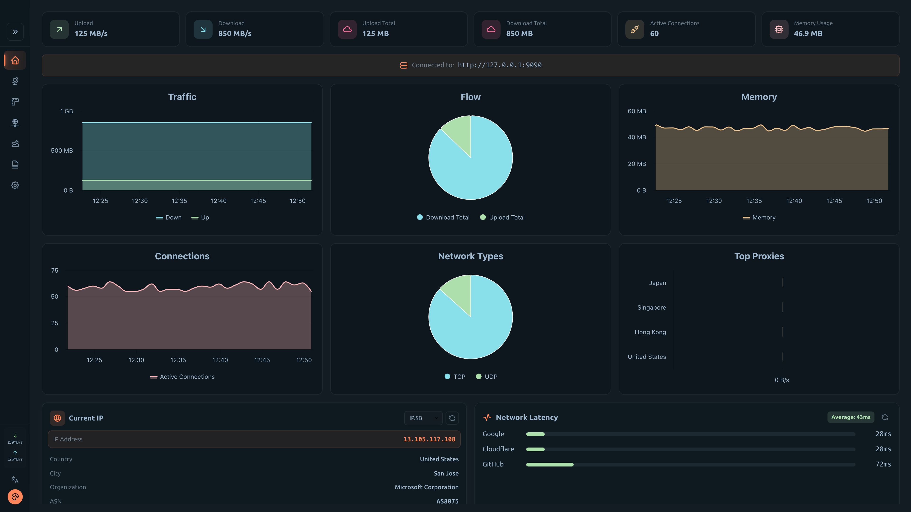 | 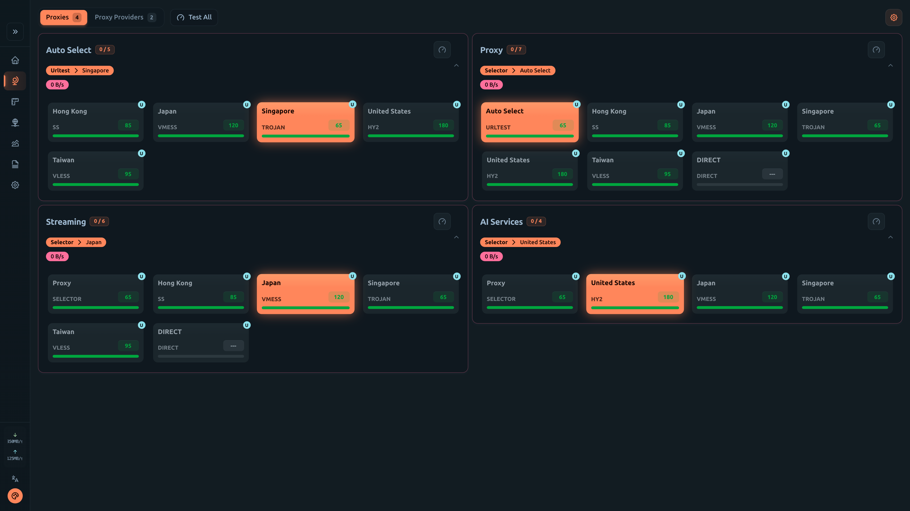 |

|                             Connections                             |                          Rules                          |
| :-----------------------------------------------------------------: | :-----------------------------------------------------: |
| 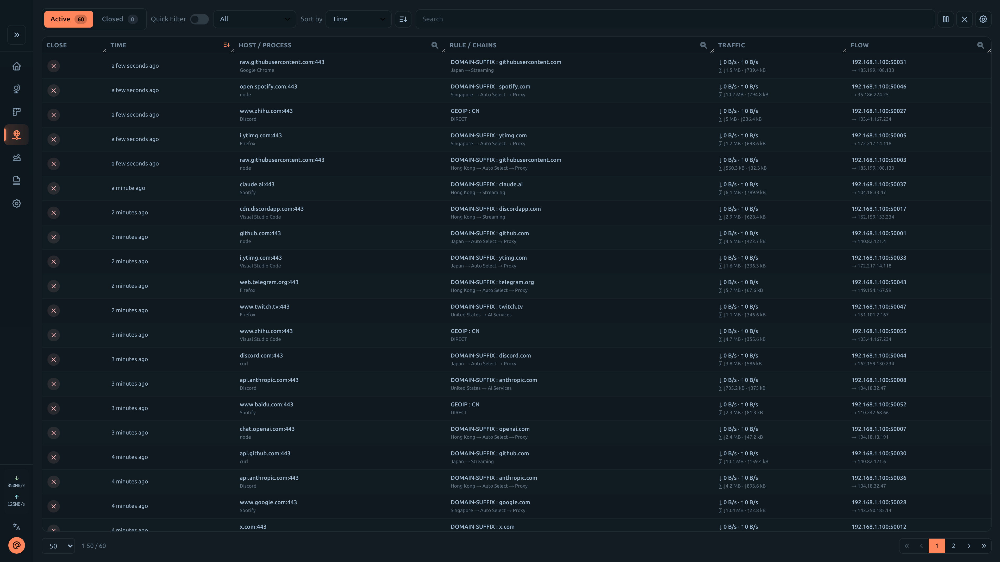 | 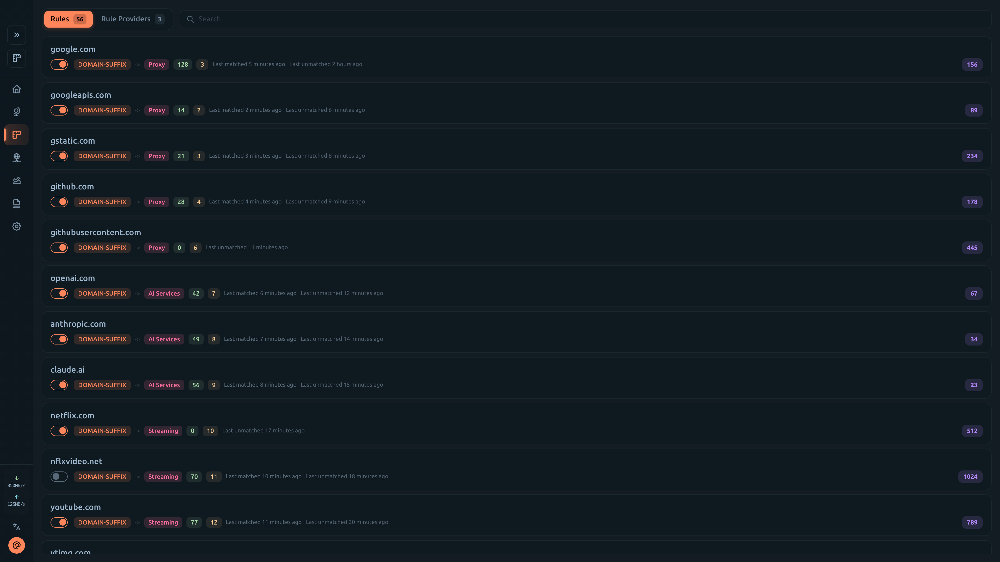 |

|                         Logs                          |                          Config                           |
| :---------------------------------------------------: | :-------------------------------------------------------: |
| 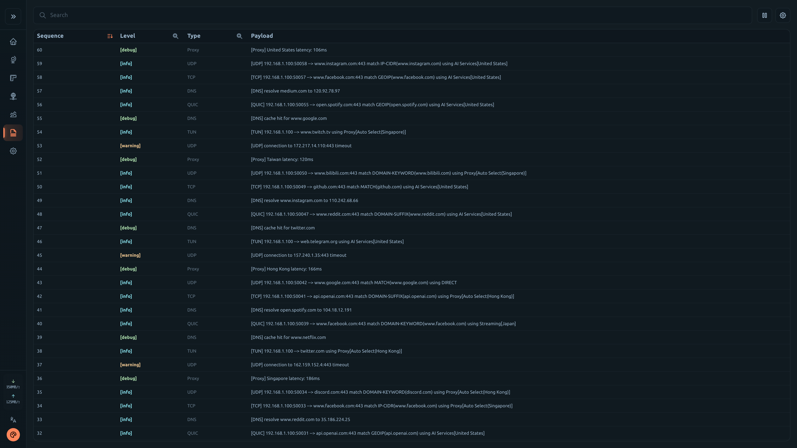 | 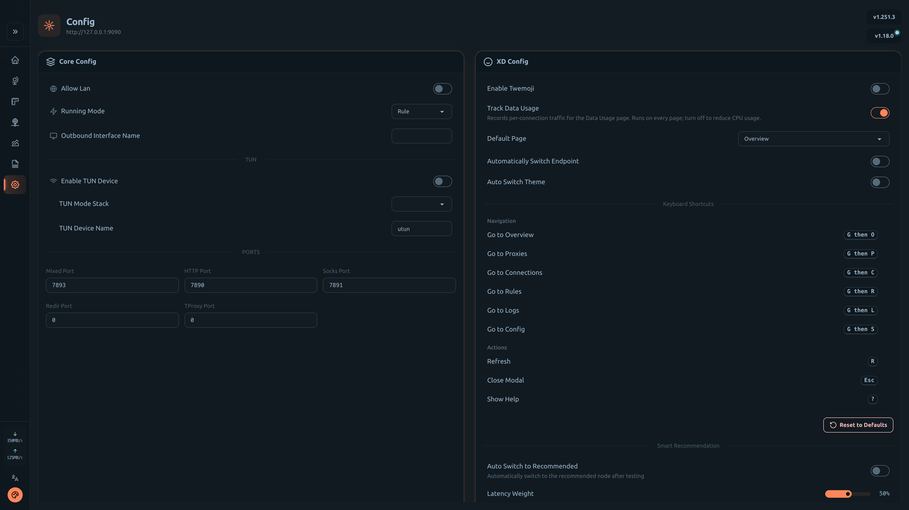 |

</details>

<details>
<summary><b>Mobile Screenshots</b></summary>

|                             Overview                              |                             Proxies                             |                               Connections                               |
| :---------------------------------------------------------------: | :-------------------------------------------------------------: | :---------------------------------------------------------------------: |
| 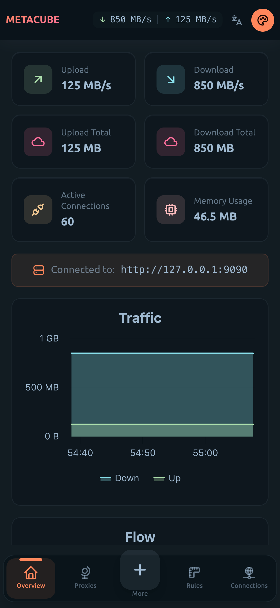 | 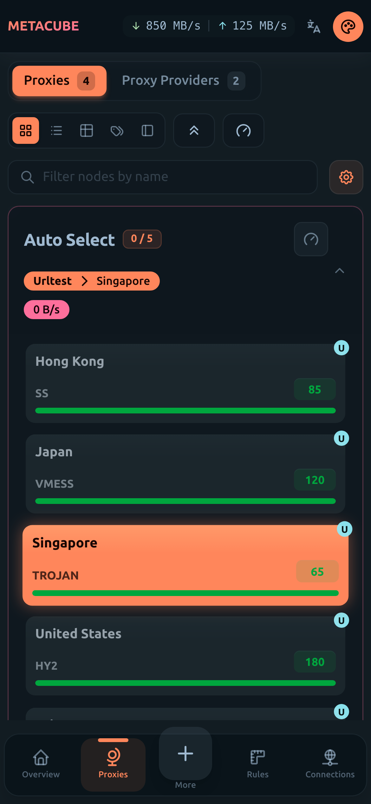 | 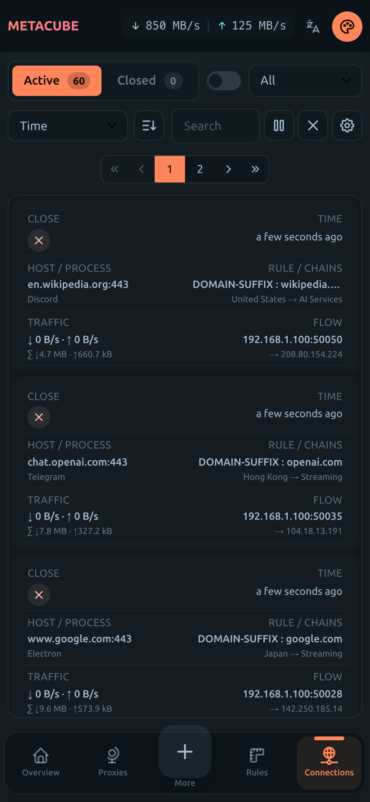 |

|                            Rules                            |                           Logs                            |                            Config                             |
| :---------------------------------------------------------: | :-------------------------------------------------------: | :-----------------------------------------------------------: |
| 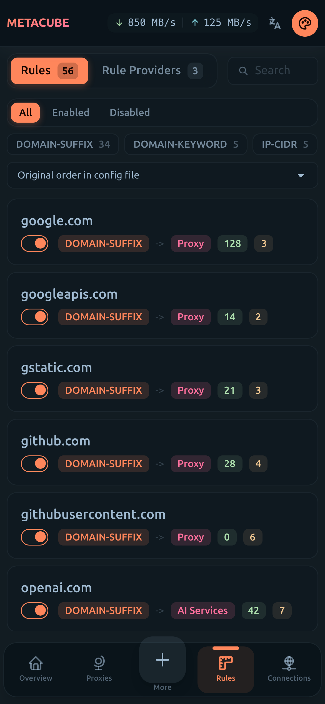 | 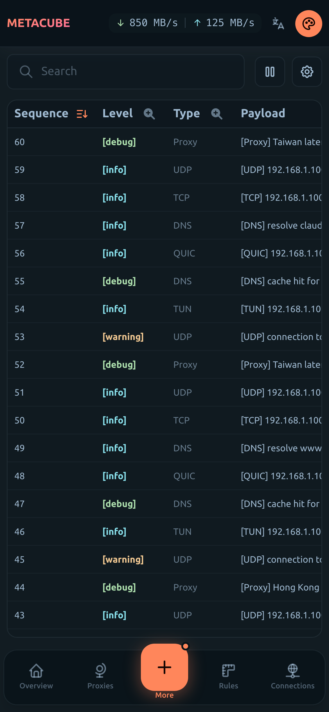 | 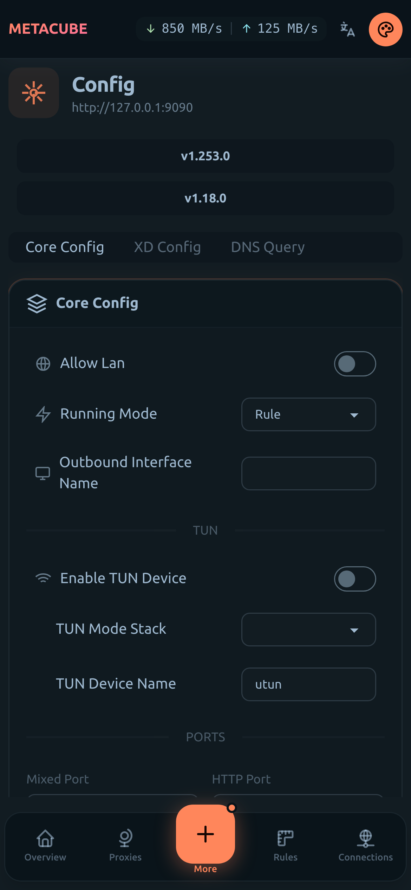 |

</details>

## 🔗 Official Sites

Use one of these official hosted-panel deployments:

| Site             | URL                                    |
| :--------------- | :------------------------------------- |
| Primary          | https://d.metacubex.one                |
| GitHub Pages     | https://metacubex.github.io/metacubexd |
| Cloudflare Pages | https://metacubexd.pages.dev           |

## 🚀 Deployment

metacubexd ships in **three forms from one codebase**:

| Form                       | Who hosts the UI                                                | Who runs the kernel                 | Best for                                 |
| :------------------------- | :-------------------------------------------------------------- | :---------------------------------- | :--------------------------------------- |
| **Hosted panel** (classic) | official sites, static files, or the standalone panel container | your own remote mihomo              | pointing a browser at an existing mihomo |
| **Desktop app**            | the app (bundled)                                               | the app supervises a bundled mihomo | a managed runtime on one machine         |
| **All-in-one server**      | the Docker image                                                | the container's bundled mihomo      | a router / NAS / VPS                     |

> The classic **pure-panel mode still works against any remote mihomo** — the
> kernel-control and profile features simply stay hidden when the dashboard
> isn't talking to a bundled agent.

### 1. Hosted Panel (point at your own mihomo)

Enable and protect the external controller in your mihomo `config.yaml`:

```yaml
external-controller: 0.0.0.0:9090
secret: 'replace-with-a-strong-secret'
```

Binding to `0.0.0.0` exposes the controller on every interface. Restrict it
with a firewall, use a strong secret, and configure
[`external-controller-cors`](#unable-to-connect-to-backend-when-self-hosting-cors)
for the exact dashboard origin.

Then open one of the official hosted sites listed above and enter your mihomo
`{url, secret}`, or self-host the static assets via `external-ui`:

```shell
# Clone the prebuilt gh-pages branch
git clone https://github.com/metacubex/metacubexd.git -b gh-pages /etc/mihomo/ui

# Set external-ui in your config:
#   external-ui: /etc/mihomo/ui

# Update to the latest build later:
git -C /etc/mihomo/ui pull -r
```

#### Standalone hosted-panel container

**`ghcr.io/metacubex/metacubexd`** is another distribution of the hosted-panel
architecture: it serves only the dashboard over HTTP on port `80`; it does not
bundle or supervise mihomo. Point it at a mihomo instance you run separately.
One panel can manage several backends, and HTTP hosting avoids the browser's
HTTPS-to-HTTP mixed-content block when the backend is local.

```shell
docker run -d --name metacubexd -p 127.0.0.1:8080:80 \
  ghcr.io/metacubex/metacubexd:latest
```

For a safe starting point for the separately managed kernel, see the
[minimal Mihomo configuration example](./docs/config.yaml). Review its network
settings before making the controller available outside the local machine.

### 2. Desktop App

Download the installer for your platform from the
[latest release](https://github.com/metacubex/metacubexd/releases/latest):

| OS                    | Arch  | File                                         |
| :-------------------- | :---- | :------------------------------------------- |
| macOS (Apple Silicon) | arm64 | `MetaCubeXD-<version>-mac-arm64.dmg`         |
| macOS (Intel)         | x64   | `MetaCubeXD-<version>-mac-x64.dmg`           |
| Windows               | x64   | `MetaCubeXD-<version>-win-x64.exe`           |
| Windows               | arm64 | `MetaCubeXD-<version>-win-arm64.exe`         |
| Debian / Ubuntu       | x64   | `MetaCubeXD-<version>-linux-amd64.deb`       |
| Debian / Ubuntu       | arm64 | `MetaCubeXD-<version>-linux-arm64.deb`       |
| Fedora / RHEL / SUSE  | x64   | `MetaCubeXD-<version>-linux-x86_64.rpm`      |
| Fedora / RHEL / SUSE  | arm64 | `MetaCubeXD-<version>-linux-aarch64.rpm`     |
| Arch Linux            | x64   | `MetaCubeXD-<version>-linux-x64.pacman`      |
| Arch Linux            | arm64 | `MetaCubeXD-<version>-linux-aarch64.pacman`  |
| Other Linux           | x64   | `MetaCubeXD-<version>-linux-x86_64.AppImage` |
| Other Linux           | arm64 | `MetaCubeXD-<version>-linux-arm64.AppImage`  |

The desktop app **bundles its own mihomo kernel and auto-configures the local
endpoint** — you don't enter any address. Manage profiles, edit configs, and
start/stop the kernel directly inside the app.

> **These builds are unsigned.** Download them only from this repository's
> [official GitHub releases](https://github.com/metacubex/metacubexd/releases),
> verify that the URL and release tag are correct, and decide whether you trust
> the artifact before bypassing an OS warning. The project does not currently
> provide publisher identity verification through code signing.

**macOS** — Gatekeeper blocks unsigned apps ("MetaCubeXD is damaged and can't
be opened"). After dragging the app to `/Applications`, strip the quarantine
attribute:

```shell
xattr -dr com.apple.quarantine /Applications/MetaCubeXD.app
```

…or right-click the app → **Open** → **Open** in the confirmation dialog.

MetaCubeXD can also be installed through the Homebrew cask in this repository:

```shell
brew tap metacubex/metacubexd https://github.com/MetaCubeX/metacubexd.git
brew install --cask metacubexd
```

**Windows** — SmartScreen shows "Windows protected your PC". Click
**More info** → **Run anyway**.

**Linux** — install the native package for your distribution, or make the
AppImage executable and run it:

```shell
# Debian / Ubuntu
sudo apt install ./MetaCubeXD-*-linux-*.deb

# Fedora / RHEL
sudo dnf install ./MetaCubeXD-*-linux-*.rpm

# openSUSE
sudo zypper install ./MetaCubeXD-*-linux-*.rpm

# Arch Linux and derivatives
sudo pacman -U ./MetaCubeXD-*-linux-*.pacman

# Distribution-independent AppImage
chmod +x MetaCubeXD-*-linux-*.AppImage
./MetaCubeXD-*-linux-*.AppImage
```

> **System proxy and TUN are separate features.** System proxy changes the
> current user's OS proxy settings through platform tools and does not install
> the privileged helper; platform policy may still request authorization. TUN
> routes machine traffic at the network layer and requires the one-time helper
> installation described in [TUN mode (desktop)](#tun-mode-desktop).

#### TUN mode (desktop)

**TUN routes traffic at the network layer**, including applications that do not
honor per-app proxy settings (unlike the mixed proxy port, which only catches
apps you point at it). Because system-level routing needs root/admin, the
desktop app installs a small **privileged helper** the first time you enable
TUN — a background service that performs the privileged network setup on the
app's behalf. Enabling TUN therefore prompts for **administrator authorization**
the first time (the OS elevation dialog). The helper persists across sessions,
so later enables don't re-prompt for install.

> The helper is installed by an unsigned app. Confirm that you downloaded the
> app from the official release page before approving its administrator prompt.

**Per-OS notes**

- **macOS** — the helper is registered as a root **LaunchDaemon**; you approve
  it through the standard `osascript` "wants to make changes" administrator
  prompt. The kernel binds the system's `utun` interface.
- **Windows** — the helper is registered as an auto-start **Windows service**
  (UAC prompt). The build ships **`wintun.dll`** alongside the kernel, which
  mihomo's wintun backend needs — no separate download.
- **Linux** — the helper is registered as a root **systemd** unit; the elevation
  prompt is **`pkexec`** (the GNOME/PolicyKit authorization dialog). On a headless
  box without a Polkit agent you may need to install/enable one.

**If TUN takes down your network**

TUN reroutes default traffic, so a bad config or a stuck tunnel can drop
connectivity. Two recoveries:

- Click **"Recover network"** in the app — it tears down the TUN routing and
  restores normal networking without quitting.
- **Quit the app normally** — a normal exit tears down TUN and restores routing.
  If the app had to be force-quit, reopen it and use **Recover network**.

If you hit a problem, open an issue with the app version, OS and architecture,
the exact prompt or error, and whether **Recover network** restored connectivity.
Do not include secrets or subscription URLs; report security issues through the
[private security channel](./.github/SECURITY.md).

### 3. All-in-One Server (Docker)

The `metacubexd-server` image bundles the dashboard UI, the control agent, and
a per-arch mihomo kernel. One container serves the panel, supervises the
kernel, and exposes the proxy. The
[copyable Compose example](./docs/docker-compose.yml) requires secrets through
a local `.env` file; the inline version below shows the same runtime layout.

```yaml
# compose.yaml — proxy-only by default; TUN is an advanced override
services:
  metacubexd:
    image: ghcr.io/metacubex/metacubexd-server:latest
    restart: unless-stopped
    environment:
      CONTROL_TOKEN: 'change-me-control'
      CLASH_SECRET: 'change-me-clash'
      GITHUB_TOKEN: '' # optional read-only token for Releases API checks
      CONTROL_PORT: '8080'
      CLASH_API_PORT: '9090'
      MIXED_PORT: '7890'
      TZ: 'Asia/Shanghai'
    ports:
      - '8080:8080' # dashboard UI + /api/control agent API
      - '9090:9090' # mihomo Clash API + WebSocket (UI endpoint target)
      - '7890:7890' # mixed proxy port
    volumes:
      - 'metacubexd-data:/data'

volumes:
  metacubexd-data: {}
```

```shell
docker compose up -d

# Update
docker compose pull && docker compose up -d
```

> **Keep the control surface on a trusted network.** Docker publishes the ports
> above on all host interfaces unless you bind them to a specific address. The
> server deliberately injects `CONTROL_TOKEN` into the browser so the same-origin
> dashboard can call `/api/control`; consequently, that token is **not** access
> control for the dashboard itself. Set `CONTROL_TOKEN`, but also restrict access
> with host/network ACLs or an authenticated reverse proxy before exposing the
> dashboard beyond a trusted LAN. An optional `GITHUB_TOKEN` is also exposed to
> the browser for authenticated Releases checks, so use a narrowly scoped token.
> Protect the Clash API and mixed proxy port too.
> See [Security Policy](./.github/SECURITY.md).

Open `http://<host>:8080` for the dashboard. The control agent unlocks the
kernel/profile UI automatically: the server injects `CONTROL_TOKEN` into the
same-origin page, so the dashboard authenticates its `/api/control` probe
without you entering the token anywhere.

**Point the UI endpoint at the kernel.** The dashboard talks to mihomo's Clash
API directly (never proxied), so set the endpoint to:

| Field  | Value                            |
| :----- | :------------------------------- |
| URL    | `http://<host>:9090`             |
| Secret | the `CLASH_SECRET` you set above |

If the UI and Clash API use different origins, allow the dashboard origin in
the active profile's
[`external-controller-cors`](#unable-to-connect-to-backend-when-self-hosting-cors)
configuration.

#### Environment variables

| Variable         | Default                  | Purpose                                                                                                                              |
| :--------------- | :----------------------- | :----------------------------------------------------------------------------------------------------------------------------------- |
| `CONTROL_TOKEN`  | **required for control** | Bearer token for `/api/control/**`; also accepted as `?token=` for SSE. Without it, protected control routes fail closed with `503`. |
| `CLASH_SECRET`   | _(none)_                 | Secret for mihomo's Clash API (`external-controller`). Set one and use it as the UI endpoint's **Secret**.                           |
| `GITHUB_TOKEN`   | _(none)_                 | Optional read-only token for authenticated GitHub Releases checks. Omit it to keep anonymous requests.                               |
| `CONTROL_PORT`   | `8080`                   | Port serving the dashboard UI + control agent API.                                                                                   |
| `CLASH_API_PORT` | `9090`                   | Port for mihomo's Clash API + WebSocket. The UI endpoint targets this port.                                                          |
| `MIXED_PORT`     | `7890`                   | mihomo mixed (HTTP + SOCKS) proxy port.                                                                                              |
| `DATA_DIR`       | `/data`                  | Writable profiles, active configuration, geo data, and runtime caches.                                                               |
| `MIHOMO_BIN`     | `/usr/local/bin/mihomo`  | Absolute path to the mihomo executable used by the server.                                                                           |
| `TZ`             | _(container default)_    | Timezone for logs/scheduling, e.g. `Asia/Shanghai`.                                                                                  |

The named volume mounts `/data`, which holds your profiles, the active config,
and the kernel's geo / fake-ip caches. It **must be writable** — a read-only
data dir makes the kernel exit non-zero.

#### TUN mode (advanced)

TUN needs `NET_ADMIN`, the `/dev/net/tun` device, and host networking. Override
the service:

```yaml
services:
  metacubexd:
    image: ghcr.io/metacubex/metacubexd-server:latest
    restart: unless-stopped
    network_mode: host
    cap_add:
      - NET_ADMIN
    devices:
      - '/dev/net/tun:/dev/net/tun'
    environment:
      CONTROL_TOKEN: 'change-me-control'
      CLASH_SECRET: 'change-me-clash'
    volumes:
      - 'metacubexd-data:/data'

volumes:
  metacubexd-data: {}
```

With `network_mode: host` the `ports:` mapping is ignored — the container
binds `8080`/`9090`/`7890` directly on the host. Enable a `tun:` block in your
profile's mihomo config for the tunnel to come up.

### Profiles & Config Editor (desktop / server)

When connected to a bundled agent (desktop app or the server image), the
dashboard gains a **profile manager**:

- Create, duplicate, rename, and delete multiple profiles.
- Import a subscription by URL (fetched with `User-Agent: clash.meta`); the
  `upload / download / total / expire` usage from `Subscription-Userinfo` is
  shown on a usage card.
- Edit any profile in an in-browser **Monaco editor with mihomo YAML schema**
  completion and validation.
- **Activate** a profile to compose it, validate it with `mihomo -t`, and restart
  the kernel only after validation succeeds.

Schema diagnostics are advisory and never block saving. Activation's
`mihomo -t` check is the final validation, and the kernel restarts only after it
passes. A **"disable validation"** toggle is available for bleeding-edge mihomo
keys the bundled schema doesn't know yet.

### Kernel versions and custom binaries

Both the desktop app and the server bundle a pinned mihomo release. The current
version is shown in the control UI and tracked in
`packages/agent/src/kernel/assets.ts`. The desktop's kernel-version panel can
download and switch among published mihomo versions; it does not expose an
arbitrary local binary-path picker. The server accepts an absolute custom path
through `MIHOMO_BIN`, which takes precedence over its bundled binary.

## 🩺 Troubleshooting

### "Unable to connect to backend" when self-hosting (CORS)

If the dashboard loads but cannot connect to the Mihomo backend — even though
the External Controller is reachable directly in your browser — the cause is
usually **CORS**.

When you host the dashboard on your own address (e.g. `http://192.168.1.2:8080`),
the browser treats requests to the External Controller (e.g.
`http://192.168.1.2:9090`) as cross-origin. Mihomo only answers cross-origin
requests from origins listed in its `external-controller-cors` allow-list, so
requests from your dashboard are rejected and the connection fails.

Add your dashboard's origin to the allow-list in your Mihomo `config.yaml`:

```yaml
external-controller-cors:
  allow-private-network: true
  allow-origins:
    - 'http://192.168.1.2:8080' # your dashboard's address
    # or, for trusted local networks only:
    # - '*'
```

> Tip: if you still cannot connect, open your browser's DevTools (F12) →
> Console and look for CORS-related errors to confirm the cause.

### Kernel won't start (desktop / server)

When the bundled kernel fails to reach `running`:

- **Server port collision.** The server defaults to control `8080`, Clash API
  `9090`, and mixed proxy `7890`. Stop the conflicting process or change the
  corresponding `CONTROL_PORT`, `CLASH_API_PORT`, or `MIXED_PORT` value and its
  host port mapping.
- **Desktop port diagnosis.** The desktop app chooses separate free loopback
  ports for its control API, Clash API, and mixed proxy on every launch. Do not
  assume `9090`, and do not send `/api/control` requests to the Clash endpoint;
  use the addresses reported by the app and its logs.
- **macOS quarantine kills the bundled binary.** An unsigned `.app` downloaded
  from the internet has its bundled mihomo quarantined. Run
  `xattr -dr com.apple.quarantine /Applications/MetaCubeXD.app`, then reopen it.
- **`SIGILL` / "illegal instruction" on amd64.** Old or virtualized CPUs choke
  on the generic amd64 build. metacubexd ships the **`-compatible`**
  (`GOAMD64=v1`) asset specifically to avoid this; if the server uses a custom
  `MIHOMO_BIN`, point it at the `-compatible` mihomo build.

### Two log streams — which is which

- **Clash logs** (the existing **Logs** page): mihomo's own log feed over the
  Clash API WebSocket — proxy decisions, rule matches, DNS, etc.
- **Kernel logs** (control agent, SSE): the mihomo **subprocess** stdout/stderr
  captured by the supervisor — startup banners, crashes, config-parse errors.
  Use these when the kernel won't start or exits unexpectedly.

### Read-only data directory

The kernel needs a **writable** home for `profiles/`, the active config, and geo
/ fake-ip caches. On the server, ensure `DATA_DIR` (default `/data`) is writable.
The desktop app stores writable state in Electron's per-user `userData`
directory; its packaged `resources` directory is not the runtime data home.

### Health check (server)

The container's health endpoint is `GET /api/control/health` on
`CONTROL_PORT` (default `8080`). A `200` means the dashboard + control agent
are up; it does **not** assert the kernel is running (check the kernel panel
for that).

## 🛠️ Development

This repository is a **pnpm 10 monorepo**:

- `packages/ui` — Nuxt dashboard and static hosted panel
- `packages/agent` — shared profile, kernel, and control-API logic
- `apps/server` — Nitro all-in-one server
- `apps/desktop` — Electron desktop application

Install dependencies, then choose the surface you are changing:

```shell
pnpm install

pnpm dev          # UI only; connect it to an existing mihomo
pnpm dev:server   # build the UI, then run the Nitro server
pnpm dev:desktop  # Nuxt HMR + Electron + bundled mihomo
```

Build boundaries are intentionally explicit:

```shell
pnpm build:ui       # static hosted-panel output: packages/ui/.output/public
pnpm build:server   # Nitro/agent only: apps/server/.output
pnpm build          # build:ui + build:server
pnpm build:desktop  # Electron main/preload/helper bundles only; no installer

pnpm typecheck      # all workspace typechecks
pnpm lint           # workspace lint scripts
```

Official desktop installers require a generated renderer, the correct mihomo
binary for each target architecture, and platform packaging tools; the release
workflow assembles those steps. See [CONTRIBUTING.md](./CONTRIBUTING.md) for
package tests, local packaging guidance, and required desktop smoke tests.

## 📚 Project documentation

- [Contributing guide](./CONTRIBUTING.md)
- [Security policy and private vulnerability reporting](./.github/SECURITY.md)
- [Domain vocabulary](./CONTEXT.md)
- [UI product principles](./packages/ui/PRODUCT.md)
- [UI design system](./packages/ui/DESIGN.md)
- [Agent manual smoke tests](./packages/agent/MANUAL.md)
- [All-in-one server Compose example](./docs/docker-compose.yml)
- [Example mihomo configuration](./docs/config.yaml)

## 📄 License

[MIT](./LICENSE)

## 🙏 Credits

- [Nuxt](https://github.com/nuxt/nuxt) - The Intuitive Vue Framework
- [Vue.js](https://github.com/vuejs/core) - The Progressive JavaScript Framework
- [daisyUI](https://github.com/saadeghi/daisyui) - Tailwind CSS components
- [Tailwind CSS](https://tailwindcss.com) - Utility-first CSS framework
